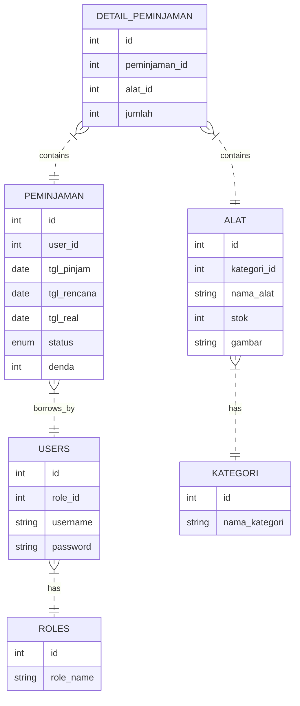
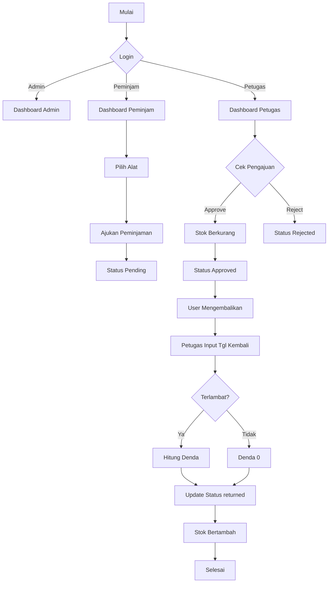

# Aplikasi Manajemen Peminjaman Alat (APA)

Aplikasi web fullstack untuk manajemen peminjaman alat (Lab/Bengkel) berbasis PHP Native (MVC) dan MySQL.

## Fitur Utama
- **Role Based Access Control**: Admin, Petugas, Peminjam.
- **Manajemen Alat**: CRUD Alat dengan upload gambar.
- **Peminjaman & Pengembalian**: Flow pengajuan, persetujuan, dan pengembalian dengan denda.
- **Stok Otomatis**: Stok berkurang saat disetujui, bertambah saat kembali (via Database Trigger).
- **Denda Otomatis**: Perhitungan denda keterlambatan (via Database Function).

## Persyaratan Sistem
- XAMPP (Apache + MySQL/MariaDB)
- PHP >= 7.4 (Ekstensi `pdo_mysql` dan `gd` aktif)
- Browser Modern (Chrome/Firefox)

## Cara Instalasi
1. **Extract/Clone** folder `APA` ke dalam folder `htdocs` XAMPP (misal: `C:\xampp\htdocs\APA`).
2. **Hidupkan XAMPP**: Start Apache dan MySQL.
3. **Import Database**:
   - Buka PHPMyAdmin (`http://localhost/phpmyadmin`).
   - Buat database baru dengan nama `db_peminjaman`.
   - Import file `database/db_peminjaman.sql`.
4. **Konfigurasi** (Jika diperlukan):
   - Edit `app/config/config.php` jika password database bukan kosong.
5. **Jalankan**:
   - Buka browser dan akses `http://localhost/APA`.

## Akun Default
- **Admin**: `admin` / `admin123`
- **Petugas**: `petugas` / `petugas123`
- **Peminjam**: `user` / `user123`

## Struktur Database (ERD Simpel)



## Alur Sistem (Flowchart)



## Struktur Folder
```
/app
  /config       # Konfigurasi DB
  /controllers  # Logika Aplikasi
  /core         # Framework MVC
  /models       # Akses Database
  /views        # Tampilan HTML
/assets         # CSS/JS custom
/database       # File SQL
/public         # Folder publik (uploads)
/index.php      # Entry point
```

---
Dibuat oleh AI Agent Antigravity.
